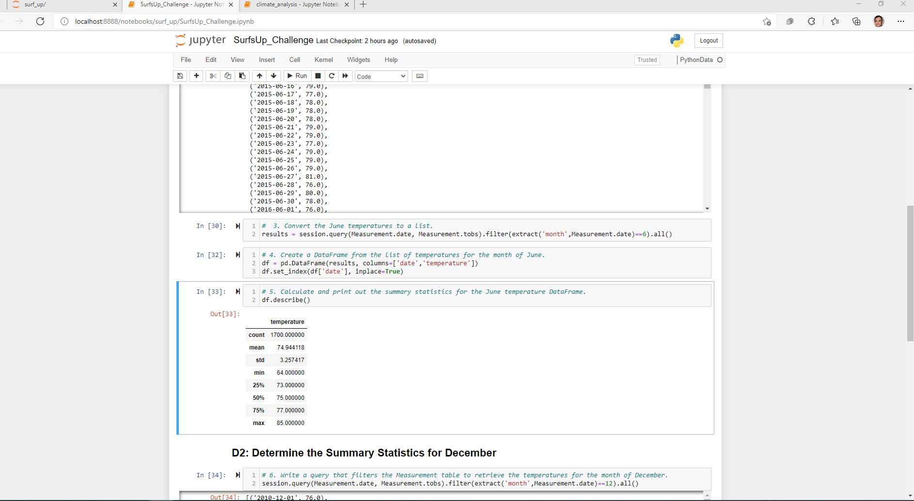
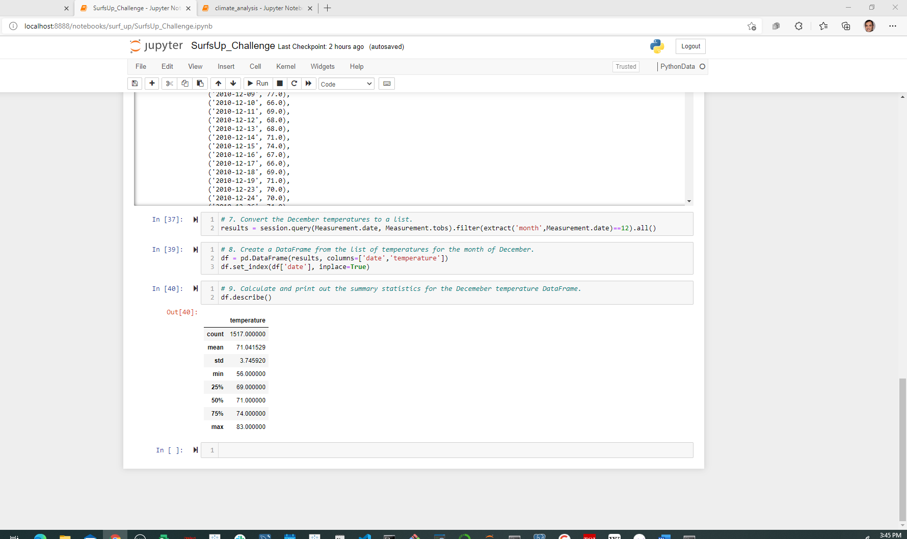

## Project: A written report for the statistical analysis:

Sponser: Surf&Icecream.Inc CEO W.Avy

Project Manager: Nayan Patel

## Deliverables:

Deliverable 1: Determine the Summary Statistics for June

June Results:

Deliverable 2: Determine the Summary Statistics for December

December Results:

Deliverable 3: A written report for the statistical analysis

## Overview of the analysis:

Temperature data for the months of June and December in Oahu, in order to determine if the surf and ice cream shop business is sustainable year-round.

## Summary of Analysis:

Reviewing results we can see than temperatures are really better for surfing in month of June and for Icream shop is good weather year around

